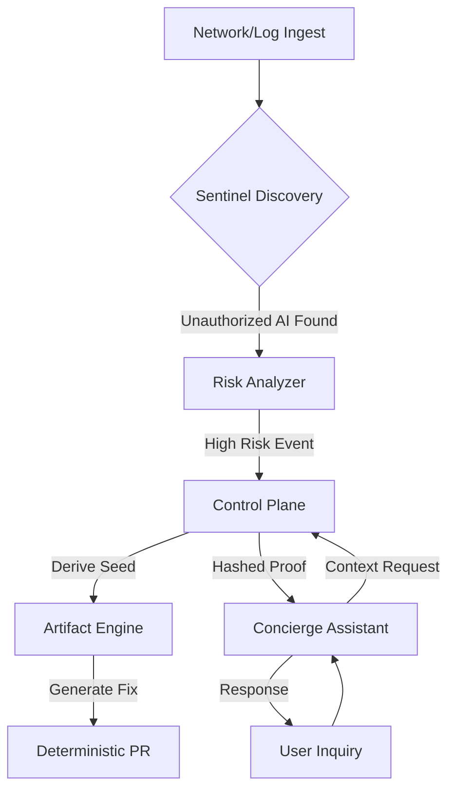
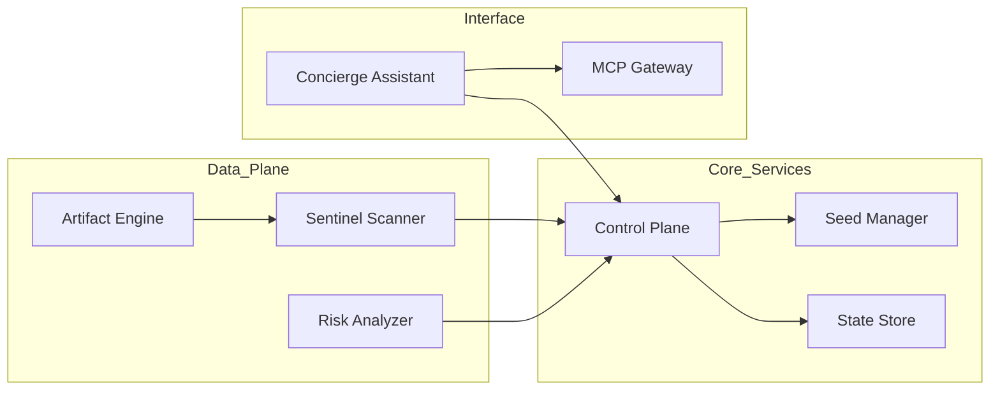

<!-- PROPRIETARY AND CONFIDENTIAL -->
<!-- Copyright © 2026 Tony Ray Macier III. All Rights Reserved. -->

# Architecture — Thalos Prime Sovereign Discovery Platform

**Owner:** Tony Ray Macier III
**Version:** 2.0.0

## System Diagram

## Module Interaction

## Component Boundaries
- `/services/control-plane` — Brainstem: determinism, seeding, session state
- `/services/discovery-sentinel` — Eyes: passive network audits, shadow IT detection
- `/services/artifact-engine` — Hands: production-ready code and infrastructure templates
- `/core` — Primitives: stable reusable logic
- `/system` — Orchestration: pipeline coordination
