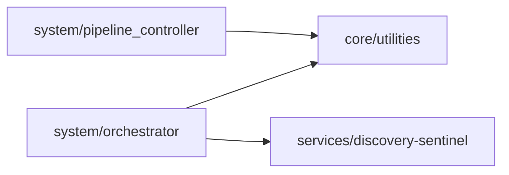

<!-- PROPRIETARY AND CONFIDENTIAL -->
<!-- Copyright © 2026 Tony Ray Macier III. All Rights Reserved. -->

# System Module

**Version:** 2.0.0
**Owner:** Tony Ray Macier III

## Purpose
Controls orchestration and execution pipelines for the ThalosPrime platform.

## Modules
- `orchestrator.py` — Main pipeline coordinator
- `pipeline_controller.py` — Pipeline lifecycle management
- `config.example.yml` — Configuration template

## Dependency Diagram

## Extension Guidelines
To add a new pipeline step:
1. Add a method to `ThalosOrchestrator`
2. Call `_log_event()` before and after
3. Update `system/execution_flow.md` with the new step
