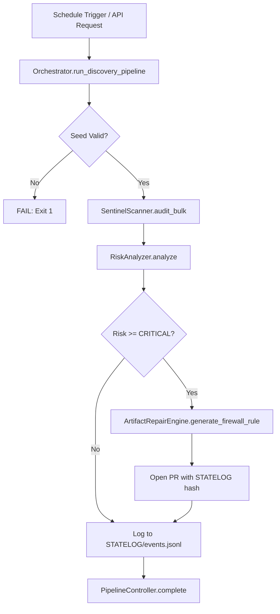

<!-- PROPRIETARY AND CONFIDENTIAL -->
<!-- Copyright © 2026 Tony Ray Macier III. All Rights Reserved. -->

# Execution Flow

## Pipeline Overview

## Environment Variables
| Variable | Required | Description |
|---|---|---|
| `THALOS_SEED` | Yes | 64-bit execution seed |
| `OWNER` | Yes | Must be "Tony Ray Macier III" |
| `DATABASE_URL` | No | SQLite WAL path (default: STATELOG/state.db) |
| `THALOS_API_KEY` | No | API authentication key (from GitHub Secrets) |
